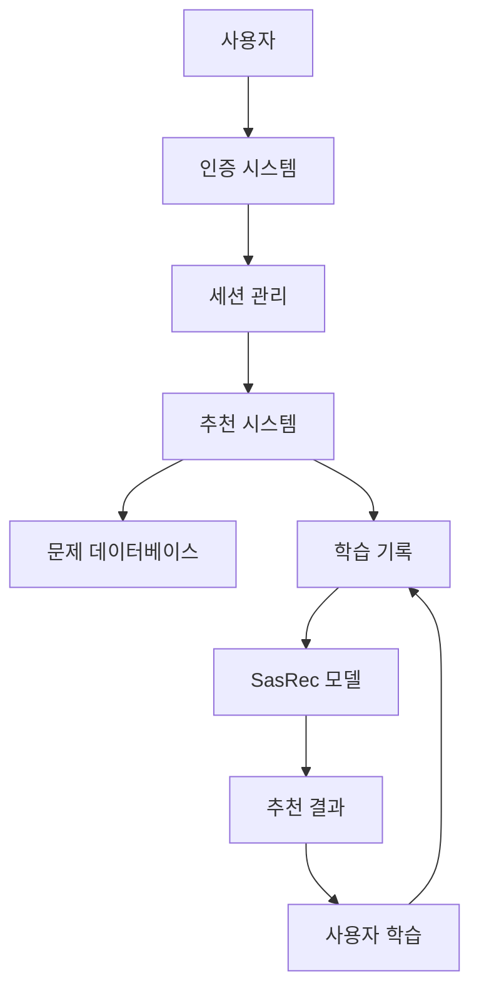
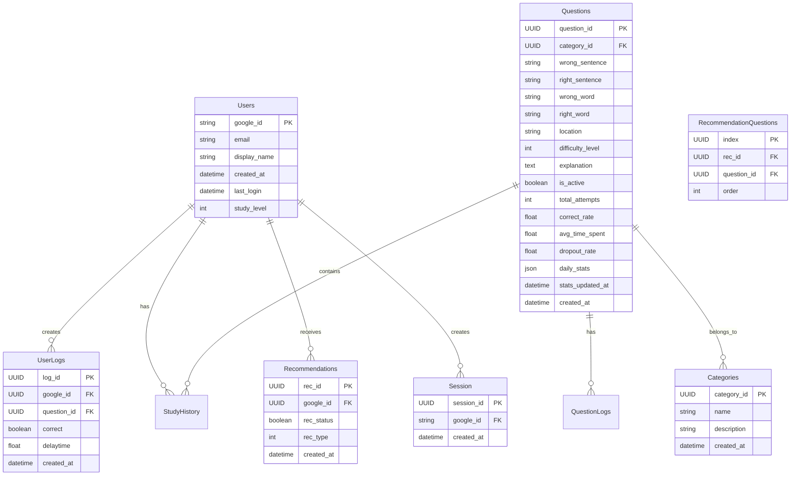

# NARAT 백엔드

NARAT은 개인화된 학습 경험을 제공하는 교육 플랫폼입니다. 이 프로젝트는 SasRec(Self-Attentive Sequential Recommendation) 알고리즘을 적용한 추천 시스템을 통해 사용자에게 맞춤형 문제를 추천합니다.

## 목차

- [기술 스택](#기술-스택)
- [시스템 구조](#시스템-구조)
- [데이터베이스 구조](#데이터베이스-구조)
- [API 문서](#api-문서)
- [추천 시스템](#추천-시스템)
  - [SasRec 모델](#sasrec-모델)
  - [이전 SSREF 모델](#이전-ssref-모델)
- [설치 및 실행](#설치-및-실행)

## 기술 스택

- **프레임워크**: FastAPI
- **데이터베이스**: PostgreSQL
- **ORM**: SQLAlchemy
- **인증**: Google OAuth
- **추천 알고리즘**: SasRec (Self-Attentive Sequential Recommendation)
- **기타 라이브러리**: 
  - torch: 딥러닝 프레임워크
  - transformers: 트랜스포머 모델 구현
  - numpy: 수치 계산 및 알고리즘 구현
  - pandas: 데이터 처리
  - pydantic: 데이터 검증
  - uvicorn: ASGI 서버

## 시스템 구조



## 데이터베이스 구조

NARAT의 데이터베이스는 다음과 같은 테이블 구조로 설계되어 있습니다:



### 카테고리 설명

- **Category 0**: 문법적으로 틀린 단어/구절 (예: 베개/베게)
- **Category 1**: 용례가 다른 단어/구절 (예: 금세/금새)
- **Category 2**: 띄어쓰기 문제

### 난이도 레벨

- **Level 1**: 상식이다. (예: 않/안, 설겆이/설거지)
- **Level 2**: 아이 뭐 헷갈릴 수도 있지~ (예: 왠일/웬일)
- **Level 3**: 아 이게 맞던가..? (예: 어따대고/얻다 대고)
- **Level 4**: 헷갈린다. 네이버 검색 ㄱㄱ (예: 반짓고리/반짇고리)
- **Level 5**: 충격!!! 말도 안돼. (예: 면이 불다/면이 붇다)

### 학습 레벨 (Study Level)

사용자의 전반적인 학습 성과를 나타내는 레벨입니다:

- **S**: 최상위 레벨 (Super)
  - 높은 정답률과 빠른 응답 시간
  - 모든 난이도의 문제를 잘 풀어냄
  - 일관된 학습 패턴 보유

- **A**: 중상위 레벨 (Advanced)
  - 양호한 정답률과 응답 시간
  - 중간~높은 난이도의 문제를 잘 풀어냄
  - 안정적인 학습 패턴 보유

- **B**: 기본 레벨 (Basic)
  - 기본적인 학습 진행 중
  - 낮은~중간 난이도의 문제에 집중
  - 학습 패턴 발전 중

## API 문서

### 인증 API

- **POST /auth/google/login**: Google OAuth 로그인
- **GET /auth/google/callback**: Google OAuth 콜백 처리
- **POST /auth/logout**: 로그아웃

### 사용자 API

- **GET /users/me**: 현재 로그인한 사용자 정보 조회
- **PUT /users/me**: 사용자 정보 업데이트
- **GET /users/me/study-level**: 사용자 학습 레벨 조회
- **PUT /users/me/study-level**: 사용자 학습 레벨 업데이트

### 문제 API

- **GET /questions**: 문제 목록 조회
  - `category_id`: 카테고리 ID로 필터링 (선택)
  - `difficulty_level`: 난이도 레벨로 필터링 (선택)
  - `limit`: 조회할 문제 수 (기본값: 10)
  - `offset`: 시작 위치 (기본값: 0)
- **GET /questions/{question_id}**: 특정 문제 조회
- **GET /questions/random**: 랜덤 문제 조회
  - `category_id`: 카테고리 ID로 필터링 (선택)
  - `difficulty_level`: 난이도 레벨로 필터링 (선택)

### 카테고리 API

- **GET /categories**: 카테고리 목록 조회
- **GET /categories/{category_id}**: 특정 카테고리 정보 조회
- **GET /categories/{category_id}/questions**: 특정 카테고리의 문제 목록 조회
  - `difficulty_level`: 난이도 레벨로 필터링 (선택)
  - `limit`: 조회할 문제 수 (기본값: 10)
  - `offset`: 시작 위치 (기본값: 0)

### 학습 기록 API

- **POST /logs**: 학습 기록 생성
  - `question_id`: 문제 ID
  - `correct`: 정답 여부
  - `delaytime`: 문제 풀이 시간 (초)
- **GET /logs**: 사용자의 학습 기록 조회
  - `limit`: 조회할 기록 수 (기본값: 10)
  - `offset`: 시작 위치 (기본값: 0)
- **GET /logs/stats**: 사용자의 학습 통계 조회
  - `category_id`: 카테고리 ID로 필터링 (선택)
  - `difficulty_level`: 난이도 레벨로 필터링 (선택)

### 추천 API

- **POST /recommendations**: 새로운 추천 생성
  - `rec_type`: 추천 유형 (1: 초기 추천, 2: 후속 추천)
- **GET /recommendations**: 사용자의 추천 목록 조회
  - `limit`: 조회할 추천 수 (기본값: 5)
  - `offset`: 시작 위치 (기본값: 0)
- **GET /recommendations/{rec_id}**: 특정 추천 정보 조회
- **GET /recommendations/{rec_id}/questions**: 특정 추천의 문제 목록 조회

### 세션 API

- **POST /sessions**: 새로운 세션 생성
- **GET /sessions**: 사용자의 세션 목록 조회
  - `limit`: 조회할 세션 수 (기본값: 10)
  - `offset`: 시작 위치 (기본값: 0)
- **GET /sessions/{session_id}**: 특정 세션 정보 조회

### 학습 API

- **POST /api/study/submit**: 학습 결과 제출
  - Request Body:
    ```json
    {
      "session_token": "string",
      "question_id": "integer",
      "correct": "boolean"
    }
    ```
  - Response:
    ```json
    {
      "success": "true",
      "explanation": "string"
    }
    ```

- **POST /api/study/recent-wrong**: 최근에 틀린 문제 목록 조회
  - Request Body:
    ```json
    {
      "session_token": "string",
      "limit": "integer (default: 5)"
    }
    ```
  - Response:
    ```json
    {
      "recent_wrong_answers": [
        {
          "wrong_sentence": "string",
          "right_sentence": "string",
          "wrong_word": "string",
          "right_word": "string",
          "explanation": "string",
          "created_at": "string (ISO format)"
        }
      ]
    }
    ```

- **POST /api/study/stats**: 학습 통계 조회
  - Request Body:
    ```json
    {
      "session_token": "string"
    }
    ```
  - Response:
    ```json
    {
      "category_stats": [
        {
          "category": "string",
          "total": "integer",
          "correct": "integer",
          "correct_rate": "float"
        }
      ],
      "difficulty_stats": [
        {
          "level": "integer",
          "total": "integer",
          "correct": "integer",
          "correct_rate": "float"
        }
      ]
    }
    ```

- **POST /api/study/recent-history**: 최근 학습 내역 조회
  - Request Body:
    ```json
    {
      "session_token": "string",
      "limit": "integer (default: 10)"
    }
    ```
  - Response:
    ```json
    {
      "recent_history": [
        {
          "question_id": "integer",
          "wrong_sentence": "string",
          "right_sentence": "string",
          "correct": "boolean",
          "time_spent": "float",
          "created_at": "string (ISO format)"
        }
      ],
      "time_stats": {
        "average_time": "float",
        "total_time": "float",
        "total_questions": "integer"
      }
    }
    ```

서버 실행 후 다음 URL에서 API 문서를 확인할 수 있습니다:
- Swagger UI: http://localhost:8000/docs
- ReDoc: http://localhost:8000/redoc

## 추천 시스템

### SasRec 모델

NARAT의 현재 추천 시스템은 SasRec(Self-Attentive Sequential Recommendation) 알고리즘을 기반으로 구현되었습니다. 이 알고리즘은 다음과 같은 특징을 가집니다:

1. **Self-Attention 메커니즘**
   - 시퀀스 내 아이템 간의 관계를 학습
   - 장기 의존성과 단기 의존성을 모두 고려
   - 가중치 기반의 아이템 간 상호작용 모델링

2. **Position Embedding**
   - 시퀀스 내 아이템의 위치 정보 보존
   - 순서 정보를 임베딩에 반영
   - 시퀀스 길이에 상관없이 일관된 표현 가능

3. **Item Embedding**
   - 각 아이템의 고유한 특성을 벡터로 표현
   - 아이템 간의 의미적 유사성 학습
   - 차원 축소를 통한 효율적인 표현

4. **Multi-head Self-Attention**
   - 다양한 관점의 패턴 학습
   - 병렬적인 어텐션 계산
   - 복잡한 시퀀스 패턴 포착

### 이전 SSREF 모델

이전 버전의 추천 시스템은 SSREF(Sequential Self-Refinement) 알고리즘을 사용했습니다. 이 모델은 `temp_route_recommendations.py`에 보관되어 있으며, 다음과 같은 특징을 가졌습니다:

1. **시간 기반 가중치**
   - 최근 학습 기록에 더 높은 가중치 부여
   - 지수 감소 함수를 통한 시간적 중요도 반영

2. **주제별 성공률 분석**
   - 주제별 학습 성공률 계산
   - 가중치가 적용된 성공률 측정

3. **난이도별 성공률 분석**
   - 난이도별 학습 성공률 계산
   - 사용자 수준과 난이도의 적합성 평가

4. **초기/후속 추천 구분**
   - 학습 기록 수에 따른 추천 전략 변경
   - 가중치 조정을 통한 추천 다양성 확보

### 모델 비교

| 특성 | SasRec | SSREF |
|------|---------|-------|
| 시퀀스 모델링 | Self-Attention 기반 | 시간 기반 가중치 |
| 위치 정보 | Position Embedding | 순차적 처리 |
| 아이템 표현 | Item Embedding | 직접적 ID 사용 |
| 패턴 학습 | Multi-head Attention | 통계적 분석 |
| 확장성 | 높음 | 중간 |
| 계산 복잡도 | 높음 | 낮음 |

## 설치 및 실행

### 필수 요구사항

- Python 3.8 이상
- PostgreSQL 12 이상
- CUDA 지원 GPU (선택사항, CPU에서도 실행 가능)

### 설치 방법

1. 저장소 클론:
   ```bash
   git clone https://github.com/khuda-deepdive-session/KHUDA-7TH-TOYPROJECT.git
   cd narat-backend
   ```

2. 가상 환경 생성 및 활성화:
   ```bash
   python -m venv venv
   source venv/bin/activate  # Windows: venv\Scripts\activate
   ```

3. 의존성 설치:
   ```bash
   pip install -r requirements.txt
   ```

4. 환경 변수 설정:
   ```bash
   cp .env.example .env
   # .env 파일을 편집하여 필요한 설정을 입력
   ```

5. PostgreSQL 설정:
   ```bash
   # PostgreSQL 서비스 시작
   brew services start postgresql@14
   
   # postgres 사용자 생성 및 데이터베이스 설정
   createuser -s postgres
   createdb -O postgres narat_db
   ```

6. 데이터베이스 초기화:
   ```bash
   python dbmaker.py
   python data_migration.py
   ```

7. 서버 실행:
   ```bash
   uvicorn main:app --reload
   ```

## 데이터베이스 마이그레이션

### Study Level 마이그레이션

study level을 Integer에서 String('S', 'A', 'B')로 변경하는 마이그레이션을 실행하려면:

```bash
# 가상환경 활성화
source venv/bin/activate  # Linux/Mac
# 또는
.\venv\Scripts\activate  # Windows

# 마이그레이션 실행
python migrations/study_level_migration.py
```

마이그레이션 후에는 모든 사용자의 study level이 'B'로 초기화되며, 이후 문제 풀이 결과에 따라 자동으로 'S' 또는 'A'로 업데이트됩니다.